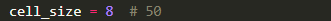
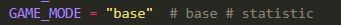

## images


###


## Description of Files

```
┌── cell.py         # Module containing the Cell class
│   └── Cell        # Class representing an individual cell on the game board
├── game.py         # Module containing the GameOfLife class
│   └── GameOfLife  # Class implementing the game logic of "Game of Life"
├── admin.py        # Module containing the Admin class
│   └── Admin       # Class managing game functions
├── core.py         # The main program file containing the main loop and event handling
└── main.py         # File that launches the game
```

## License

This project is licensed under the MIT License. See the [LICENSE](LICENSE) file for details.
